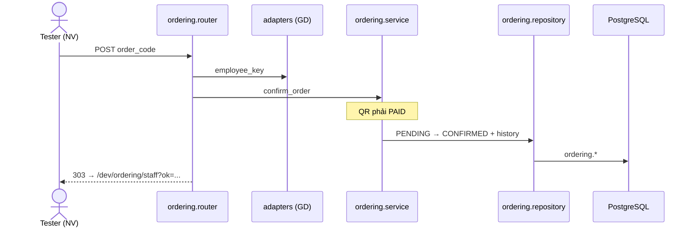

# Sequence — POST /dev/ordering/staff/confirm

```mermaid
sequenceDiagram
  actor U as Tester (NV)
  participant R as ordering.router
  participant A as adapters (GD)
  participant S as ordering.service
  participant Repo as ordering.repository
  participant DB as PostgreSQL

  U->>R: POST order_code
  R->>A: employee_key
  R->>S: confirm_order
  Note over S: QR phải PAID
  S->>Repo: PENDING → CONFIRMED + history
  Repo->>DB: ordering.*
  R-->>U: 303 → /dev/ordering/staff?ok=...
```
