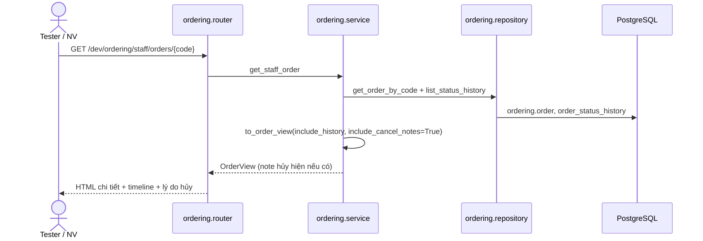

# Sequence — GET /dev/ordering/staff/orders/{code}

NV xem chi tiết đơn + lịch sử trạng thái (có note hủy).

```mermaid
sequenceDiagram
  actor E as Tester / NV
  participant R as ordering.router
  participant S as ordering.service
  participant Repo as ordering.repository
  participant DB as PostgreSQL

  E->>R: GET /dev/ordering/staff/orders/{code}
  R->>S: get_staff_order
  S->>Repo: get_order_by_code + list_status_history
  Repo->>DB: ordering.order, order_status_history
  S->>S: to_order_view(include_history, include_cancel_notes=True)
  S-->>R: OrderView (note hủy hiện nếu có)
  R-->>E: HTML chi tiết + timeline + lý do hủy
```
