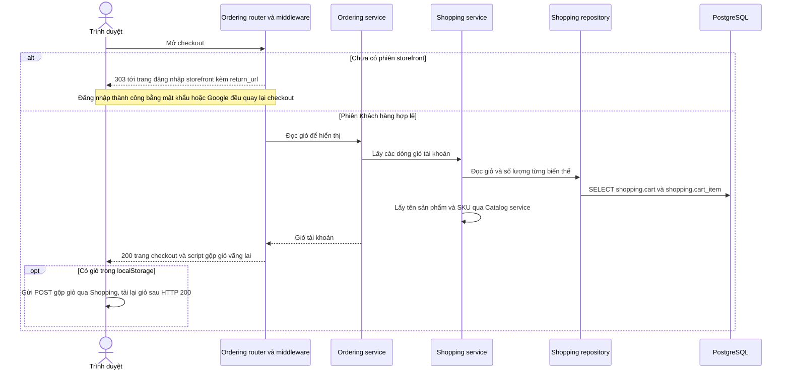

# GET /api/v1/ordering/checkout

Điểm vào và quay lại checkout trong UC-02 AC-7.

```mermaid
sequenceDiagram
    actor Browser as Trình duyệt
    participant Route as Ordering router và middleware
    participant Service as Ordering service
    participant Shopping as Shopping service
    participant Repo as Shopping repository
    participant DB as PostgreSQL
    Browser->>Route: Mở checkout
    alt Chưa có phiên storefront
        Route-->>Browser: 303 tới trang đăng nhập storefront kèm return_url
        Note over Browser,Route: Đăng nhập thành công bằng mật khẩu hoặc Google đều quay lại checkout
    else Phiên Khách hàng hợp lệ
        Route->>Service: Đọc giỏ để hiển thị
        Service->>Shopping: Lấy các dòng giỏ tài khoản
        Shopping->>Repo: Đọc giỏ và số lượng từng biến thể
        Repo->>DB: SELECT shopping.cart và shopping.cart_item
        Shopping->>Shopping: Lấy tên sản phẩm và SKU qua Catalog service
        Service-->>Route: Giỏ tài khoản
        Route-->>Browser: 200 trang checkout và script gộp giỏ vãng lai
        opt Có giỏ trong localStorage
            Browser->>Browser: Gửi POST gộp giỏ qua Shopping, tải lại giỏ sau HTTP 200
        end
    end
```
