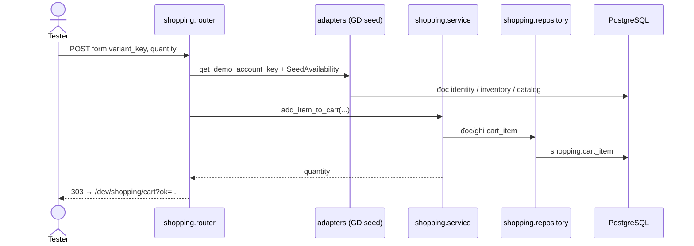

# Sequence — POST /dev/shopping/cart/add

UI thử (feature/shopping). Actor: developer / tester.

```mermaid
sequenceDiagram
  actor U as Tester
  participant R as shopping.router
  participant A as adapters (GD seed)
  participant S as shopping.service
  participant Repo as shopping.repository
  participant DB as PostgreSQL

  U->>R: POST form variant_key, quantity
  R->>A: get_demo_account_key + SeedAvailability
  A->>DB: đọc identity / inventory / catalog
  R->>S: add_item_to_cart(...)
  S->>Repo: đọc/ghi cart_item
  Repo->>DB: shopping.cart_item
  S-->>R: quantity
  R-->>U: 303 → /dev/shopping/cart?ok=...
```
