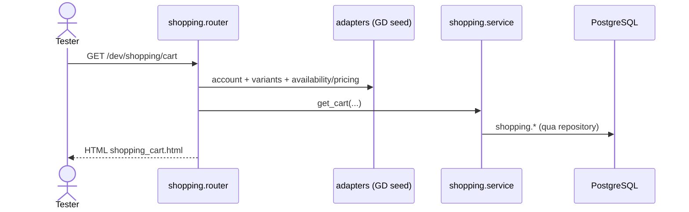

# Sequence — GET /dev/shopping/cart

```mermaid
sequenceDiagram
  actor U as Tester
  participant R as shopping.router
  participant A as adapters (GD seed)
  participant S as shopping.service
  participant DB as PostgreSQL

  U->>R: GET /dev/shopping/cart
  R->>A: account + variants + availability/pricing
  R->>S: get_cart(...)
  S->>DB: shopping.* (qua repository)
  R-->>U: HTML shopping_cart.html
```
