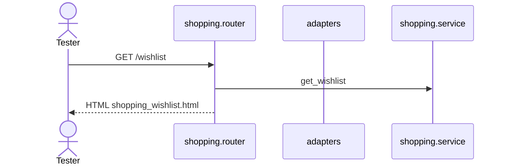
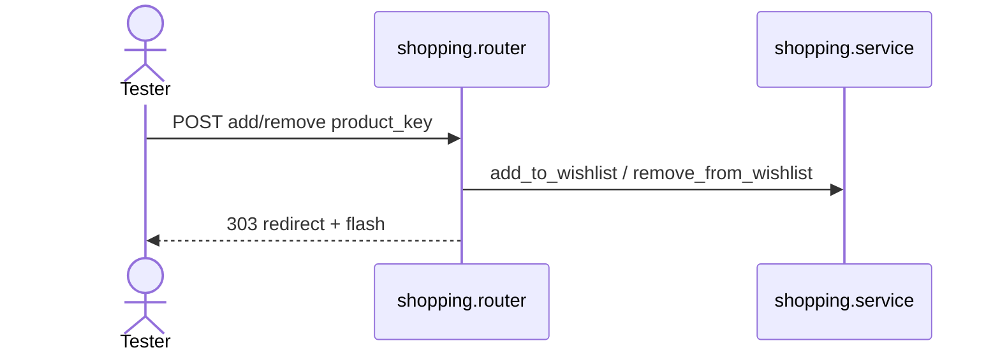

# Sequence — wishlist UI thử

## GET /dev/shopping/wishlist

```mermaid
sequenceDiagram
  actor U as Tester
  participant R as shopping.router
  participant A as adapters
  participant S as shopping.service
  U->>R: GET /wishlist
  R->>S: get_wishlist
  R-->>U: HTML shopping_wishlist.html
```

## POST /dev/shopping/wishlist/add | remove

```mermaid
sequenceDiagram
  actor U as Tester
  participant R as shopping.router
  participant S as shopping.service
  U->>R: POST add/remove product_key
  R->>S: add_to_wishlist / remove_from_wishlist
  R-->>U: 303 redirect + flash
```
