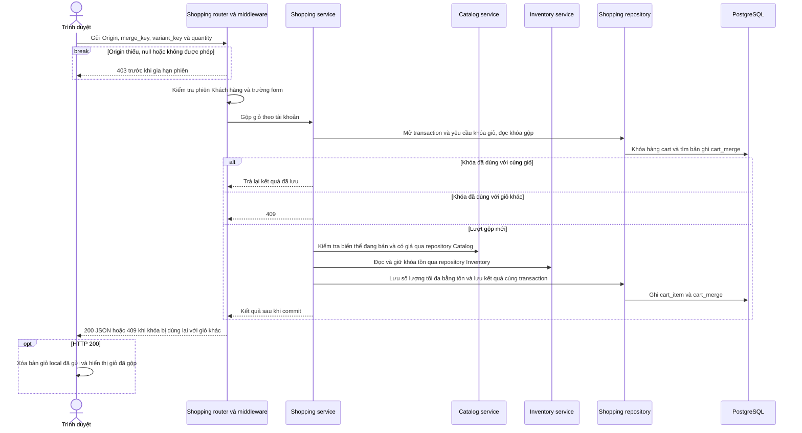

# POST /api/v1/shopping/cart/merge

UC-02 AC-7 và UC-18 2b, AC-6.

```mermaid
sequenceDiagram
    actor Browser as Trình duyệt
    participant Route as Shopping router và middleware
    participant Service as Shopping service
    participant Catalog as Catalog service
    participant Inventory as Inventory service
    participant Repo as Shopping repository
    participant DB as PostgreSQL
    Browser->>Route: Gửi Origin, merge_key, variant_key và quantity
    break Origin thiếu, null hoặc không được phép
        Route-->>Browser: 403 trước khi gia hạn phiên
    end
    Route->>Route: Kiểm tra phiên Khách hàng và trường form
    Route->>Service: Gộp giỏ theo tài khoản
    Service->>Repo: Mở transaction và yêu cầu khóa giỏ, đọc khóa gộp
    Repo->>DB: Khóa hàng cart và tìm bản ghi cart_merge
    alt Khóa đã dùng với cùng giỏ
        Service-->>Route: Trả lại kết quả đã lưu
    else Khóa đã dùng với giỏ khác
        Service-->>Route: 409
    else Lượt gộp mới
        Service->>Catalog: Kiểm tra biến thể đang bán và có giá qua repository Catalog
        Service->>Inventory: Đọc và giữ khóa tồn qua repository Inventory
        Service->>Repo: Lưu số lượng tối đa bằng tồn và lưu kết quả cùng transaction
        Repo->>DB: Ghi cart_item và cart_merge
        Service-->>Route: Kết quả sau khi commit
    end
    Route-->>Browser: 200 JSON hoặc 409 khi khóa bị dùng lại với giỏ khác
    opt HTTP 200
        Browser->>Browser: Xóa bản giỏ local đã gửi và hiển thị giỏ đã gộp
    end
```
